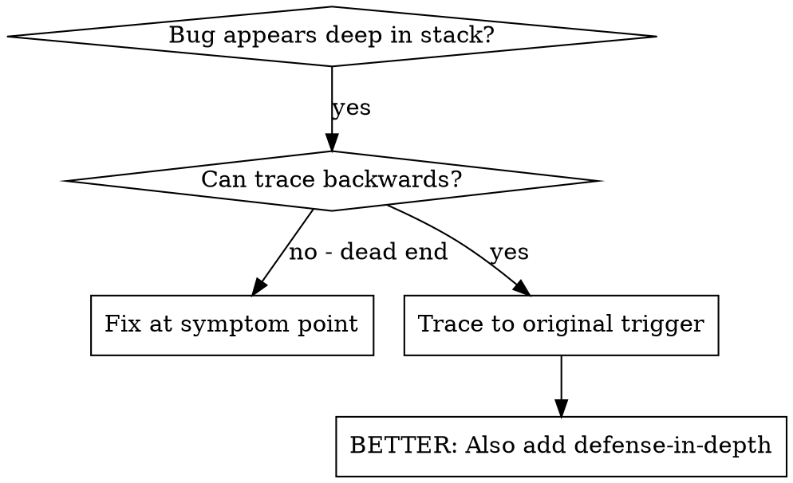
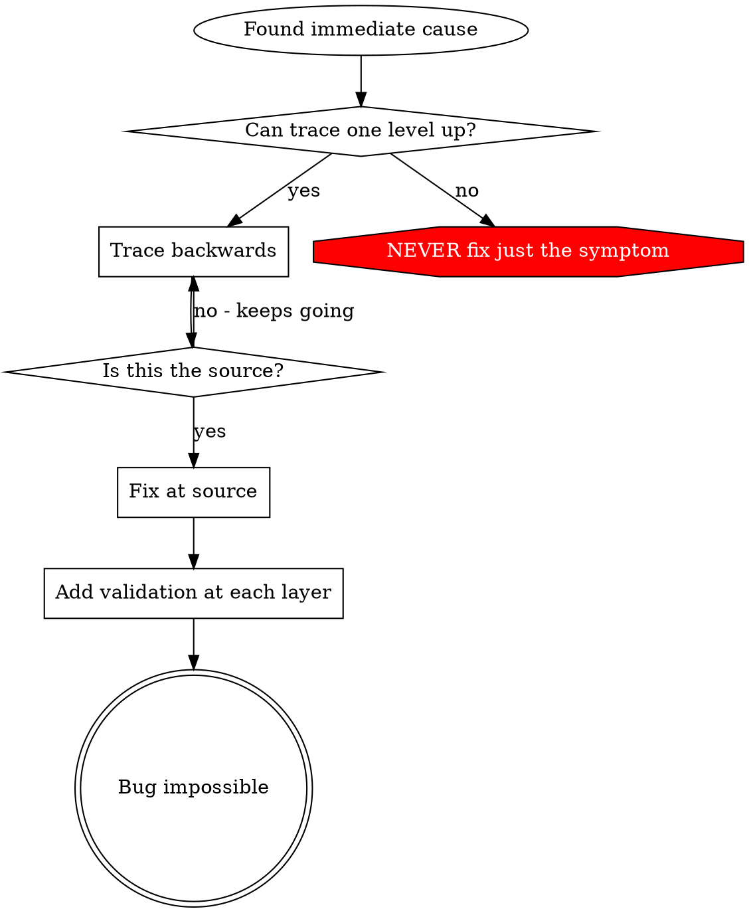

# Root Cause Tracing（反向追蹤）

## Overview

Bug 常常在 call stack 很深的地方才爆出來（檔案寫錯位置、DB 用錯路徑開啟、空字串當參數傳下去）。直覺是「在報錯的地方修」，但那是治標。

**Core principle: Trace backward through the call chain until you find the original trigger, then fix at the source.**

## 何時使用



- 錯誤發生在執行深處（不是入口）
- stack trace 很長
- 不清楚無效資料從哪冒出來
- 需要找出是哪個 test / code 觸發問題

## 追蹤流程

### 1. 觀察症狀
```
Error: 寫入 parquet 失敗，路徑 /（根目錄！）
```

### 2. 找直接原因（什麼 code 直接造成）
```python
df.to_parquet(output_path)   # output_path 是空字串 → 解析成 cwd / 根
```

### 3. 問：誰呼叫了這個？
```
PipelineWriter.flush(output_path)
  ← Pipeline.run(out_dir)
  ← CLI.main(args.out)
  ← argparse 預設 out="" 沒被覆寫
```

### 4. 一路往上追（傳了什麼值）
- `output_path = ""`（空字串）
- 空字串被當路徑 → 解析成 cwd
- 那正好是程式碼目錄

### 5. 找原始觸發點
```python
parser.add_argument("--out", default="")   # 根因：預設空字串，呼叫端忘了帶
```

## 追不動時：加 instrumentation

手動追不出來，就在危險操作**之前**印出 context + stack：

```python
import traceback, os
def write_parquet(df, path):
    if not path or path in (".", "/"):
        # 在危險操作前蒐證，不是等它失敗
        print(f"DEBUG write_parquet: path={path!r} cwd={os.getcwd()}", flush=True)
        traceback.print_stack()
    df.to_parquet(path)
```

**重點：**
- 在 pipeline / 測試中用 `print(..., flush=True)` 或 `logging`，別只 return error
- 在**操作之前**記錄，不是失敗之後
- 帶上 context：路徑、cwd、環境變數、timestamp
- `traceback.print_stack()`（或 `traceback.format_stack()`）顯示完整呼叫鏈

## 找出是哪個 test 污染了狀態

某狀態在跑測試時出現、但不知是哪個 test 造成 → 用二分法：對測試清單逐一/分段跑，第一個觸發污染的就是兇手（`uv run pytest <single_test>` 逐一驗證）。

## 核心原則



**NEVER fix just where the error appears.** 追回原始觸發點，並在源頭修。找到源頭後，最好再用 `defense-in-depth.md` 在多層加驗證。
